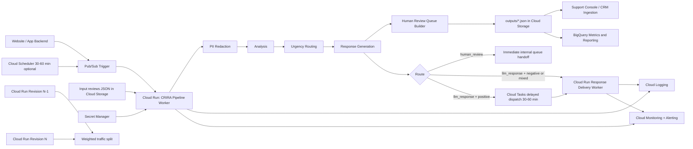

# GCP Architecture (Proposed)

## Notes
### 1) Input source and trigger strategy
- Primary input source is the RetailGenius website/app backend.
- Backend writes raw review payloads (JSON records) to storage and/or publishes review events to Pub/Sub.
- Recommended default: event-driven processing for fast handling (review-created event triggers Cloud Run quickly).
- Cost-aware option: scheduled batch trigger every 30 minutes to 1 hour using Cloud Scheduler.
- Practical hybrid: event-driven for human-review and negative/mixed `llm_response`, delayed batch windows for positive `llm_response`.

### 1.1) Routing end-state (current implementation)
- `route = human_review`:
    - enqueue immediately to internal human queue.
    - do not delay with Cloud Tasks.
- `route = llm_response` and tone is `negative` or `mixed`:
    - generate/send promptly through response delivery worker.
- `route = llm_response` and tone is `positive`:
    - delay outbound send with Cloud Tasks (30-60 minute window).
- `route = llm_response` and tone is `neutral`:
    - current response stage returns empty string (no customer-send payload).
    - treat as no-send unless policy is revised.

### 1.2) Routing policy checks before production
- Validate whether neutral non-escalated reviews should remain no-send versus short neutral acknowledgment.
- Validate whether clearly positive low-risk reviews should bypass LLM judge to reduce cost/latency.
- Keep current behavior for now, but require evaluation and canary evidence before policy lock.

### 2) What Cloud Scheduler -> Pub/Sub means
- Cloud Scheduler is a timer.
- At a configured interval (for example every 30 or 60 minutes), it sends a message to a Pub/Sub topic.
- Pub/Sub then triggers the Cloud Run pipeline worker.
- Use this when batch cost control is preferred over immediate processing.

### 3) Why two Cloud Run revisions and weighted traffic split
- Every deployment creates a new immutable Cloud Run revision.
- `Revision N-1` = last stable release; `Revision N` = new release.
- Weighted traffic split lets you canary safely (for example 90% to N-1, 10% to N).
- If metrics degrade (errors, cost spikes, quality drop), shift traffic back to N-1 immediately.
- This reduces production risk for prompt/model changes.

### 4) Secret Manager usage in this scenario
- Store API keys and integration credentials (LLM provider key, CRM/webhook tokens, service secrets).
- Cloud Run reads secrets at runtime using service account permissions.
- No secrets in source code, Docker image, or plaintext config files.

### 5) Raw JSON policy before redaction
- Yes, raw input JSON can contain unredacted PII.
- Apply strict IAM to raw input storage even if data is "just JSON".
- Policy baseline:
    - separate raw-input and redacted-output buckets,
    - only ingestion service + pipeline worker service accounts can read raw-input bucket,
    - analysts/support tools read redacted outputs by default,
    - enable Cloud Audit Logs for raw-input bucket access,
    - enforce retention and lifecycle deletion for raw payloads,
    - block all public access.

### 6) Cloud Run pipeline worker role
- The worker executes the ordered stages: raw urgency gate -> PII redaction -> analysis -> urgency routing -> response generation -> human handoff.
- The worker writes output artifacts (`review_analysis.json`, `review_urgency.json`, `review_responses.json`, `human_review_queue.json`) to Cloud Storage.

### 7) Why BigQuery is downstream of outputs
- BigQuery is for analytics/reporting, not the transactional pipeline execution path.
- Storing pipeline outputs first in Cloud Storage gives a durable source of truth and easy replay.
- BigQuery then ingests from output artifacts for:
    - route distribution and support-load trends,
    - response quality and evaluation tracking,
    - cost/latency dashboards and historical reporting.
- This keeps the runtime worker simpler and more resilient.

### 8) Should LLM responses be stored
- Yes, store output responses with governance controls.
- Keep review_id, route, internal_support_flag, decision_source, model/prompt version, timestamps.
- Restrict access to response text and apply retention policy per legal/compliance needs.

### 9) Observability focus
- Track per-stage latency, fallback/error rates, queue backlog age, delayed-dispatch backlog, and cost per 1000 reviews.
- Add alerting thresholds tied to SLA and budget (for example queue age, fallback-rate spike, token spend anomaly).

### 10) What else is needed for full cloud deployment readiness
- The brief allows a theoretical deployment design. The items below are the practical next steps for a production rollout.

1. Infrastructure as code
    - Add Terraform (or equivalent) for Cloud Run, Pub/Sub, Cloud Tasks, Cloud Storage buckets, BigQuery datasets, IAM, and alert policies.

2. CI/CD pipeline
    - Add build/test/deploy workflow with gated promotion by tests and quality checks.
    - Use Cloud Run revision rollout with staged traffic percentages and rollback automation.

3. Service account and IAM hardening
    - Separate service accounts for ingestion, pipeline worker, and delivery worker.
    - Grant minimum roles only; block broad project-level editor/owner assignments.

4. Network and perimeter controls
    - Restrict egress where possible.
    - Enforce private access paths to storage and internal integrations.

5. Data governance and retention
    - Define explicit retention windows for raw input, redacted outputs, and response logs.
    - Configure lifecycle rules and access audit review cadence.

6. Runbooks and operational readiness
    - Add incident runbooks for queue backlog, failed deploy, LLM outage, and cost spikes.
    - Define on-call alerts and escalation ownership.

7. Quality gates tied to deployment
    - Require passing unit tests and ground-truth evaluation checks before production promotion.
    - Track route distribution drift and fallback-rate drift during canary windows.
