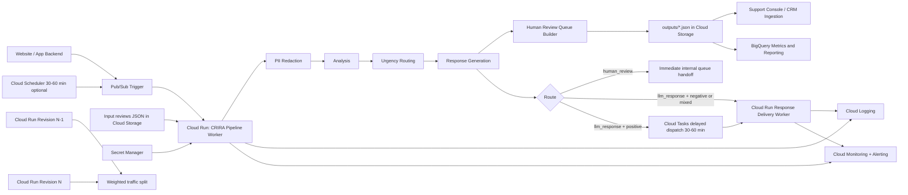

# GCP Architecture (Proposed)

## Notes
### 1) How it works
- Website/backend sends review events to Pub/Sub (or Scheduler triggers batch runs).
- Pub/Sub triggers the Cloud Run pipeline worker.
- Worker runs: raw urgency gate -> PII redaction -> analysis -> urgency routing -> response generation -> human queue build.
- Worker writes JSON artifacts to Cloud Storage.
- BigQuery ingests artifacts for reporting and quality tracking.

### 2) Routing outcomes (current)
- `human_review`: immediate internal queue handoff.
- `llm_response` + negative/mixed: immediate automated response delivery.
- `llm_response` + positive: delayed delivery (30-60 min) via Cloud Tasks.
- `llm_response` + neutral: current response stage returns empty text (effectively no-send).

### 3) Security and governance
- Store secrets in Secret Manager and inject at runtime.
- Keep raw and redacted data in separate storage areas.
- Restrict raw-data access to least-privilege service accounts only.
- Keep audit logs and retention rules for compliance.

### 4) Rollout and operations
- Use Cloud Run revisions with weighted canary traffic for safer releases.
- Monitor latency, fallback/error rates, queue age, and cost anomalies.
- Gate production promotion on tests plus ground-truth evaluation.

### Small Notes
- Scheduler -> Pub/Sub is a timer path; event-driven Pub/Sub is lower-latency.
- Route decision and response content are separate decisions; neutral may route to `llm_response` but still produce empty text.
- Store response metadata (`review_id`, `route`, `internal_support_flag`, `decision_source`, prompt/model version, timestamps) for auditability.
