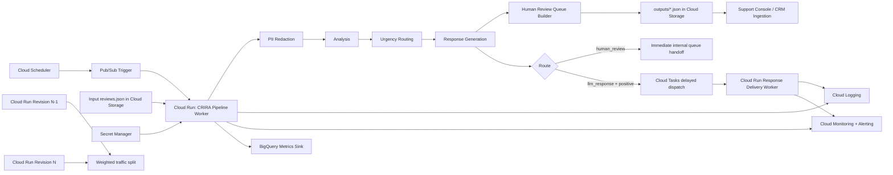

# GCP Architecture (Proposed)

## Notes
- Secrets are loaded from Secret Manager, never hard-coded.
- Only redacted review text is sent to model-driven stages.
- Human queue output is internal-use and contains recontact details for escalated reviews.
- Positive non-urgent responses can be dispatched with a short delay via Cloud Tasks.
- Rollout: use Cloud Run revisions and weighted traffic for canary model/prompt changes.
- Observability should include per-stage latency, fallback/error rates, dispatch delay backlog, and cost-per-1000 reviews.
